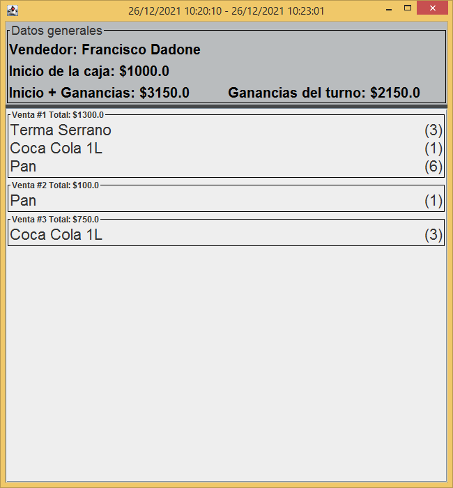

<!-- PROJECT LOGO -->
<br />
<p align="center">
<a href="https://github.com/FranciscoDadone/ControlStock">
    
</a>

<h3 align="center">Control de Stock</h3>

  <p align="center">
  Simple and easy to use stock control app for small business!
<br />
    <a href="https://github.com/FranciscoDadone/ControlStock"><strong>Explore the docs »</strong></a>
    <br />
  </p>


<!-- TABLE OF CONTENTS -->
<details open="open">
  <summary>Table of Contents</summary>
  <ol>
    <li>
      <a href="#about-the-project">About The Project</a>
      <ul>
        <li><a href="#built-with">Built With</a></li>
      </ul>
    </li>
    <li><a href="#usage">Usage</a></li>
    <li><a href="#contact">Contact</a></li>
  </ol>
</details>


<!-- ABOUT THE PROJECT -->
## About The Project
I've created this project for a small market in my city to control the stock of the articles.

<b>It features:</b>
   * Add stock
   * Edit current stock
   * Low stock warning
   * Sessions
   * Barcode scanner support
   * Stock search
   * Sessions history and details
   * Cloud automatic backup
   * And more!


### Main screen


### Add or modify stock


### Session


### History


### History details



<br />
<br />

### Built With

* [Java](https://java.com)
* [SQLite](https://www.sqlite.org)
* [MongoDB](https://mongodb.com)
* [Swing](https://es.wikipedia.org/wiki/Swing_(biblioteca_gr%C3%A1fica))


<!-- USAGE EXAMPLES -->
## Usage
Compile jar file and start the app. 
The database will be located in:

Linux filesystems: "/home/ControlStock/database/sqlite.db"

Windows filesystem: "Documents/ControlStock/database/sqlite.db"

You can also fill the mongo_credentials.yml inside that folder to have automatic backups to a remote mongo server.

Mongo credentials example:
```
{password: '******', url: 'cluster0.ma03o.mongodb.net/ProjectName?retryWrites=true&w=majority', username: 'admin'}
```


<!-- CONTACT -->
## Contact

Francisco Dadone - [@FranDadone](https://twitter.com/FranDadone) - dadonefrancisco@hotmail.com.ar

Project Link: [https://github.com/FranciscoDadone/ControlStock](https://github.com/FranciscoDadone/ControlStock)
